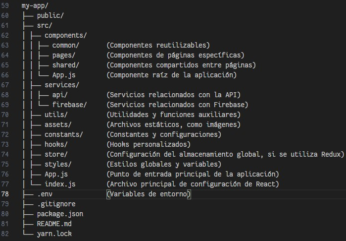

**Marvel Comics**

## Índice

- [1. Información general del proyecto](#1-información)
- [2. Manual de instrucciónes](#2-manual_de_instrucciónes)
- [3. Requerimientos](#3-requerimientos)
- [4. Patrón de arquitectura](#4-patrón_de_arquitectura)
- [5. Tecnologías implementadas](#5-tecnologías_implementadas)

# 1. Información general del proyecto

Sitio web sobre comics de Marvel, donde puedes ver información general algunos comics y añadirlos a una lista de favoritos.

# 2. Manual de instrucciones

Este manual te explica cómo acceder al contenido de la página principal, donde podrás ver los cómics que te gustan. Solo tienes que seguir estos pasos:

- Inicio de sesión: Aquí tienes que escribir tu correo electrónico y tu contraseña en los campos correspondientes. Si no tienes una cuenta, puedes crearla haciendo clic en el enlace "Crea tu cuenta" que está debajo del botón "Iniciar sesión".

- Registro: Aquí tienes que rellenar los siguientes datos para crear tu cuenta:

  - Nombre o nickname
  - Número de identificación
  - Correo electrónico
  - Contraseña (Debe tener al menos 6 caracteres)

- Página de inicio: Después de completar el registro, entrarás a la página de inicio, donde verás todos los cómics disponibles.

- Detalles y favoritos: Si haces clic en la imagen de algún cómic, podrás ver más detalles sobre él y si haces clic en el corazón lo agregarás a la sección de favoritos.

# 3. Requerimientos

Los requerimientos para la correcta visualizacion del sitio web son:

- Dispositivo tecnologico (Telefono, tablet, computador).
- Conexion a internet.
- Navegador de su preferencia (Chrome, Mozilla, Opera...).
- El navegador debe ser compatible con las tecnologías web utilizadas en el sitio (En versiones de navegador antiguas pueden fallar elementos).
- Creacion de cuenta e inicio de sesion para poder acceder a la informacion de los comics de Marvel.

# 4. Patrón de arquitectura

Patron seleccionado: Arquitectura de capas.

El patrón de arquitectura en capas es una forma de organizar el código de una aplicación en diferentes niveles de abstracción, separando las responsabilidades y facilitando el mantenimiento y la escalabilidad. Para un proyecto React API Firebase, este patrón ofrece varias ventajas, como:

- Permite separar la lógica de negocio de la interfaz de usuario y de la comunicación con la base de datos Firebase.
- Facilita el uso de servicios y librerías externas, como el sistema de autenticación y almacenamiento de Firebase, sin acoplarlos al resto del código.
- Favorece el desarrollo modular y el uso de componentes reutilizables en React, así como la implementación de pruebas unitarias y de integración.
- Mejora la legibilidad y la documentación del código, al seguir una estructura clara y coherente.

Por estas razones, he elegido el patrón de arquitectura en capas para el proyecto, siguiendo las buenas prácticas y los principios de diseño apropiados.

Como parte de esta decision, he buscado las diferentes estructuras del los archivos del proyecto segun el patron de arquitectura (Arquitectura de capas, Modelo-Vista-Controlador (MVC), Modelo-Vista-Presentador (MVP)...), siendo la mas apropiada para un proyecto de React y Firebase la Arquitectura de capas, siendo esta la estructura base del proyecto:

# 5. Tecnologías implementadas

- HTML
- CSS
- React
- Firebase
- Tailwind
